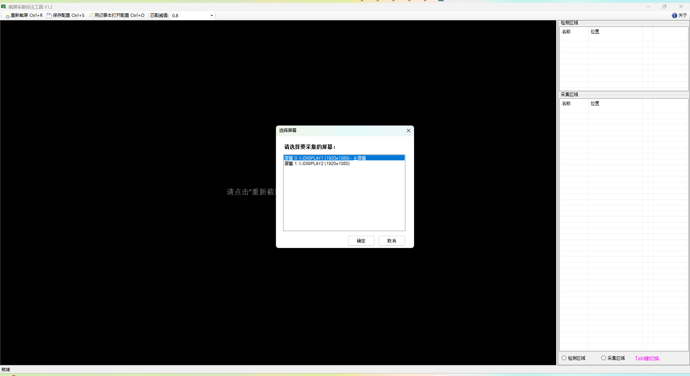
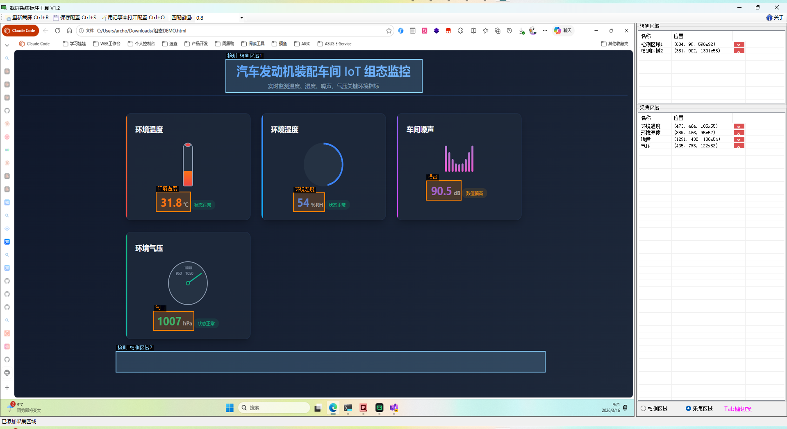

# 屏幕文本采集系统

## 项目简介

定时检查目标屏幕是否显示，然后识别指定区域的文字，支持保存 CSV 记录或转发 MQTT，也提供 HTTP API 模式调用。

**项目地址**: https://github.com/cancelpj/ScreenTextCollector

## 核心功能

- 定时采集指定屏幕画面，支持多屏幕采集（通过 ScreenNumber 指定序号）
- 支持多区域模板匹配（VerificationAreas）验证画面有效性
- 图像中的文字可采集（CollectionAreas）进行识别
- 识别结果通过 MQTT 发送到指定的 broker，不同的采集区域可配置不同的 Topic 和扩展字段
- 在 HTTP API 模式下，通过外部调用触发截图和识别
- 可选识别结果保存为本地 CSV 文件

## 开源协议

本项目基于 **GNU Affero General Public License v3 (AGPLv3)** 开源。

---

## 软件截图

### 屏幕选择功能



### 主程序界面



---

## 开发历史

### 2026年3月

#### 易用性
- **图形化标注**：抛弃旧的 Setup 命令行配置工具，重写 LabelTool 图形化标注配置工具

#### 项目结构与构建优化
- **简化项目文件结构**：使用新的 SDK 格式，重构项目配置文件
- **添加 x64 平台支持**：更新项目配置，支持 x64 平台构建
- **统一项目配置**：添加清理脚本，更新 NuGet 包引用

#### OCR 功能增强
- **新增 PaddleOCR 支持**：实现可插拔 OCR 引擎，支持 OpenCvSharp 和 PaddleOCR 两种引擎
- **图像预处理配置**：添加 OCR 引擎选项和图像预处理参数配置
- **后处理功能**：重构 OCR 服务，添加文本后处理功能
- **并行处理优化**：优化 OCR 服务并行处理逻辑

#### 测试体系建设
- **添加测试项目**：新增 ScreenTextCollector.Tests 测试项目
- **测试用例完善**：添加真实测试数据，重构测试类结构
- **性能统计**：为 OCR 测试添加性能统计功能
- **多引擎切换**：支持方便切换不同的 OcrEngine 进行测试

#### 文档与配置
- **更新 .gitignore**：优化版本控制配置
- **项目 README 完善**：更新各模块 README 文件内容

---

## 下一步计划

- 采集区域可配置为`OCR`和`图像模板匹配`两种模式，后者根据匹配的图像来区分采集值，比如绿色按钮表示`运行`状态，红色按钮表示`停止`状态。
- 实现插件化加载 OCR 引擎，引擎文件夹拷贝到 OcrEngine 目录下以后，重启程序即可加载新的引擎。

---

## 安装与配置

### 安装要求
- .NET Framework 4.8
- Windows 64 位操作系统（32 位很慢）

### 配置文件

编辑 `appsettings.json` 文件配置相应参数
- `CaptureFrequency`: 截图频率（秒）
- `CsvRecord`: 是否保存关键记录
- `MqttBroker`: MQTT Broker 配置

#### MqttBroker 配置说明

```json
{
  "MqttBroker": {
    "EnableMqttPush": true,              // 是否启用MQTT推送
    "CaptureFrequency": 2,               // 采集频率（秒）
    "Ip": "127.0.0.1",                   // MQTT服务器IP
    "Port": 1883,                        // MQTT服务器端口
    "ClientId": "MyClientId",            // MQTT客户端ID
    "Username": "admin",                 // MQTT用户名
    "Password": "password",              // MQTT密码
    "DefaultTopic": {                    // 全局默认 Topic
      "Name": "screen/collection/default",
      "ExtendPayload": {                 // 默认扩展字段
        "CLIENT": "MyClientId",
        "DEVICECODE": "110001",
        "GroupCode": "collection1"
      }
    },
    "Topics": [                          // 多 Topic 配置（优先级高于 DefaultTopic）
      {
        "Name": "screen/collection/110001",
        "ExtendPayload": {
          "GroupCode": "collection1"
        }
      },
      {
        "Name": "screen/alarm/110001",
        "ExtendPayload": {
          "GroupCode": "alarm1"
        }
      }
    ]
  }
}
```

> **ExtendPayload 合并规则**：DefaultTopic.ExtendPayload → 各 Topic.ExtendPayload，后者覆盖前者。采集区域下拉框选择具体 Topic 时使用对应的 ExtendPayload；选择空项则使用 DefaultTopic 的配置。

## 使用方法
- 运行 `LabelTool.exe`（标注工具）来图形化配置检测和采集区域。
- 运行`ScreenTextCollector.exe`即可开始采集，关闭窗口即可停止采集。运行期间要保持目标屏幕画面不被遮挡。

---

## 开发说明

### 工程结构

```
ScreenTextCollector/
├── LabelTool/                    # 图形化标注工具
├── ScreenTextCollector/          # 采集程序（WinForms应用）
│   ├── Program.cs               # 入口点，单实例运行检查
│   ├── Form1.cs                 # 主窗体，日志UI展示
│   ├── ServiceMqttPush.cs       # MQTT推送服务
│   ├── ServiceWebApi.cs         # HTTP服务
│   ├── SimpleMqttClient.cs      # 自定义MQTT客户端
│   └── FunctionCall.cs          # 核心业务逻辑
├── PluginInterface/              # 共享接口和工具类
│   ├── Tool.cs                  # 工具类（日志广播、截屏、CSV保存）
│   ├── Settings.cs              # 配置模型
│   ├── IOcrService.cs           # OCR服务接口
│   └── NLogGuiTarget.cs         # NLog自定义目标
├── ScreenTextCollector.OpenCvSharp/  # OpenCvSharp OCR实现（可选）
├── ScreenTextCollector.PaddleOCR/     # PaddleOCR OCR实现
└── ScreenTextCollector.Tests/    # 单元测试项目
```

### 构建命令

```bash
# 使用 MSBuild 构建Release版本
msbuild ScreenTextCollector.sln /p:Configuration=Release

# 或使用 dotnet build
dotnet build LabelTool/LabelTool.csproj -c Release
```

### 发布说明

```bash
# 使用 Visual Studio 中 LabelTool 项目的发布功能（同时支持图形化和命令行操作）
dotnet publish LabelTool/LabelTool.csproj  -p:PublishProfile=FolderProfile.pubxml

# 或使用一键发布脚本
publish.bat
```

会将所需文件完整发布到 `root/publish_yyyy.MM.dd.hhmmss` 目录下：
- `LabelTool.exe` - 标注工具
- `ScreenTextCollector.exe` - 采集程序

发布前需确保已安装 Visual Studio 2019 或更高版本，并配置好 MSBuild 路径。
